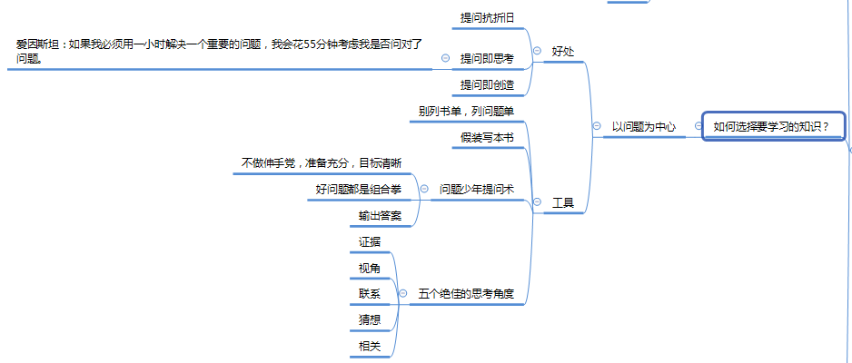

# 跃迁学习笔记

## 前言

《跃迁》一书，作者古典老师从趋势、高手的“暗箱”、战略、学习、心态等几个方面介绍了作为一个高手应该掌握的能力。并且最后回到了他的老本行职业生涯规划，介绍了高手应该成为一个什么样的人--内在修炼。纵观全书，我自己最大的几个收获就是：

* 问题比知识更重要。
* 学什么、为什么学比怎么学更重要。
* 可迭代比聪明、才气和灵感更重要。
* 头部效应是个人能力非线性增长的关键。

### 问题比知识更重要

作为一名程序员，我每天都在不停的解决问题（Bug）。有时候一个简单的问题花了很长时间都没能解决。等休息一下，头脑冷静下来之后发现，我给自己提的问题从一开始就不对，换一个角度问这个问题，问题很轻松的就解决了。爱因斯坦说过：“如果我一定要花1个小时解决一个重要的问题，我会花50分钟思考问题是什么”。我们缺的不是解决问题的办法，而是找到问题。

提出问题也是一门学问。当你遇到问题无法解决，在向别人请求帮助时，你需要反复思考你的问题到底是什么。一个更好的问题才能让你从别人那里获得更要的信息，来帮助你解决这个问题。至于如何提出一个好问题，可以看看\[提问的智慧\]\([https://github.com/FredWe/How-To-Ask-Questions-The-Smart-Way](https://github.com/FredWe/How-To-Ask-Questions-The-Smart-Way)\)。

### 学什么、为什么学比怎么学更重要

书中，作者将勤奋分为三个层次，作者称之为“勤奋的三重境界”：低水平的勤奋靠努力，中等水平的勤奋靠方法论，高水平的勤奋靠选择目标。“怎么学”指的就是中等水平的勤奋，即学习方法论。而“学什么”和“为什么学”则是选择目标，属于高水平的勤奋。只有目标明确了，才有真正的高效。

其实很多人，包括我，正处在低水平勤奋的境界上。我们不知道为什么学、学什么，甚至不知道怎么学。我们不停的焦虑，抓住一个东西就学。因为我们心里都有一个错误的价值观：学习就对了。所以我们只要是在学习，就能获得短暂的心安理得。焦虑学习的结果只会带来更多的焦虑。我们应该放下焦虑，重新思考学什么、为什么学、怎么学。《跃迁》这本书就是告诉大家，学什么、为什么学的。

### 可迭代比聪明、才气和灵感更重要

作者用韩国围棋选手李昌镐每一手只追求51%效率的例子说明了可迭代的重要性--可迭代比妙手更重要。可迭代是让事情在更加可控的情况下发展，不贪图一招制胜，因为不可持续，而是一步一个脚印。

生活就是不停地在解决问题，不要企图灵感总是会出来帮你解决问题，如果灵感一直不出现呢？你需要的是一套能解决问题的方法论，并且不断的打磨、迭代这套方法论，才能使生活中的问题变得可控。

### 头部效应是个人能力非线性增长的关键

其实在看这本书之前，我自己已经隐约领悟到这一点了。这本书的出现更加完善了我在这方面的理解。

今年已经是我大学毕业的第五个年头了。我觉得自己碌碌无为，但是身边却不乏发展得很好的同学朋友。总结思考了他们的经历，我发现他们会进入一个高价值的区域，比如头部企业、重点部门、重点项目，然后再进入更高价值的区域，比如更重要的职位、或更牛的企业，最终实现指数级增长，别人拉四匹马都追不上（线性增长）。

其实我想到的这个就是《跃迁》中提到的“头部效应”。“不公平就是大自然的一种常态”，大自然的公平就是幂律分布，只有占据了更多资源的人才能占据更多更多资源。

真正的进取，要从身边的“头部区域“开始。

## 时代的趋势

像水往低处流，像大自然趋于更加复杂，社会也有自己的发展趋势。作者介绍了上图中的三种趋势。

### 认知方式的改变：调用而非记忆知识

在互联网时代之前，人们获得的信息有限，所以记住信息的能力非常重要。但是今天的知识越来越容易获得，从裤兜里掏出手机就能查阅到非常多的信息，所以今天人类的核心竞争力就从记忆能力变成了**搜索能力**、**思考能力**和**洞察能力。**

**从人类历史的角度看，这种从“记住知识“到新的认知方式的突变式的进化，我们称之为“跃迁”。**

### 思考方式的改变：从独自思考到联机的独立思考

独自思考即碰到问题后自己一个人思考怎么解决。而联机的独立思考则是碰到问题后先看看别人是不是已经有解决方案了，再通过别人的解决方案来思考自己的解决方案。

### 核心竞争力的改变：人机合一

“任何一条行业链，一旦某个链条能大幅提高效率的新技术，这个领域的核心竞争力就会变化。”

以上这句话引用自原文，作者从两个事件证明了上面这个观点：

* 数码摄影的出现，核心竞争力从各种胶片技术走向观察和审美能力。
* 互联网的出现，教育的核心竞争力从“现场演绎”走向教研和研发能力。

并预言未来是一个教育无边界的时代，教育培训、出版、传媒、影视的便也会开始慢慢模糊。教育永存，老师也无可替代，未来的老师一定是一群“人机合一”的新教师。

## 高手的“暗箱”

 

高手的暗箱即高手的技巧、诀窍。作者以拉斐尔投影仪的故事为铺垫，阐述高手背后可能存在的暗箱：

* 跃迁带来非线性增长
* 掌握“时代魔法”才能高人一等
* 外包大脑聚焦重要的能力才能成为“超人”

**“没有一个人是仅凭努力、天赋、基于而获得巨大的成功的，跃迁式的成功都是利用了更底层规律，激发了个体的跨越式成长。”**

### 跨越式成长

高手的成长都是跃迁式式的，非线性的，而这种非线性，就是本书标题的“跃迁”。跃迁很好理解，如果你学过物理，应该会明白原子的能力跃迁。或者拿生物来做比喻，人是由细胞堆积而成的，细胞又是由原子堆积而成的，但是简单的堆积原子并不能堆出一个人来，从原子到人的变化就是跃迁式的。

实现自我跃迁的一般阶段是：认知跃迁-&gt;能力跃迁-&gt;能级跃迁。分别是意识上的、能力上的和社会地位上的跃迁。

#### 认知跃迁

认知跃迁的关键是范式的转变。重大的商业和技术突破，往往不是技术突破，而是对于技术的应用和认知方式带来的范式的突破。比如飞机的发明这个例子，人们缺的不是实现飞行的技术，而是对机械飞行原理（范式）的理解有问题。

**“心智模式或者说范式的转变，对内提升潜能，对外发现可能，这就是一个人认知跃迁的关键。”**

### 掌握时代的魔法

在这个信息泛滥的时代，人最重要的能力就是把控自己的注意力、过滤信息、联机协作。

### 外包大脑

我们生活中有很多外包大脑的例子。比如公司把系统外包，上级把基础工作外包等。外包会使你失去一些锻炼，但是也恰恰会让你更加专注于更重要的能力，前提是你知道你应该做什么。如果你不知道你的目标，那么把大脑外包之后你会更加焦虑。有些上级总是插手下级的工作，就是一个例子。

## 高手的战略

明白了趋势，制定战略。

在这个时代，我们的选择非常多，但是能选择的还是很有限的。怎么选，就成了一个重要的问题。作者认为如果我们有目标，那就努力进入目标的头部，如果没有目标，那就进入最热门的或者身边的头部。头部即是高价值区。

### 高价值区是什么？

我的理解是有目标才有高价值区。棒球手追求高击球率，所以他的高价值区是高几率击球区。股神追求高收入，所以他的高价值区是高收入，稳定的股票。新东方名师追求教学能力和社会地位。“学而思”追求市场。

那么你的目标是什么？

找到你的目标，然后确定高价值区，再思考优势。

**“不要因为容易而去做一件事，要因为有价值才做。不要因为便宜而买一件衣服，要因为值得才买。不要因为彼此习惯了就结婚，要因为相爱才结。因为我们不怕苦，怕苦得没价值；不怕累， 怕累得没有意义。”**

### 专注和迭代

专注是防守，迭代是进攻。一旦你站在高价值区，你需要建立自己的护城河，而专注就是你方法。这里的专注是战略级别的专注，像“学而思”专注于小班、中学生、奥数一样。

迭代则是高手的进攻方法。成功不靠才气，因为才气会耗尽，要靠可控可迭代的能力。

**“妙手是成为高手的最大障碍，迭代的手艺才是正途。”**

## 高手是如何修炼的？

这一部分的内容非常多，讲的是学习的方法论。分别从怎么学，怎么选，怎么转化为价值几个方面分析高手的修炼之道。

古典老师的书真是干货满满，总结到这里我都感觉我的脑袋要被干货挤爆了，赶紧吃个胃药压压惊。

## 高手是如何解决问题的？

## 高手的内在修炼

